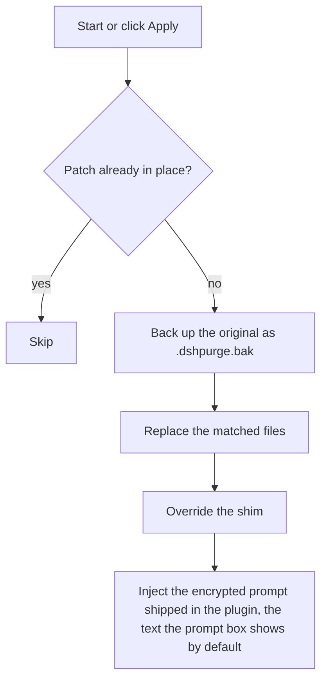
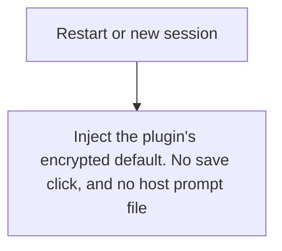
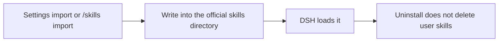

<p align="center">
  
</p>

<h1 align="center">⚔️ DeepSeek Harness cybersecurity red-team tool (dsh-purge)</h1>

<p align="center"><strong>Version 1.1.64</strong></p>

<p align="center">
  <em>DeepSeek Harness jailbreak: every model, swap prompts per model. Default prompt for 小码酱. Please star ⭐ If you build on this, see Attribution required.</em>
</p>

<p align="center">
  <a href="https://github.com/YuJunZhiXue/dsh-purge/stargazers"></a>
  <a href="https://github.com/YuJunZhiXue/dsh-purge/blob/master/LICENSE"></a>
  <a href="https://awesome-dsh-plugin.com"></a>
  <a href="https://deepseek.stream/plugins/dsh-purge"></a>
  <a href="https://www.deepseek.com/harness/"></a>
  <br>
  
  
</p>

<p align="center">
  <a href="README.md">English</a> | <a href="README.zh-CN.md">中文</a>
</p>

> **Official Web and the official desktop app are both supported.** Official `dsh web` uses profile `web`. The official desktop EXE (DeepSeek Harness **0.2.0-rc.2**) uses profile `desktop`. Install and Apply them separately. This release targets dsh 0.2 only. Older dsh builds need the matching older plugin. Community Desktop is not maintained.
>
> Adding the plugin to a profile does not patch the host. Click **dsh-purge** beside the session title → **Clean** → **Apply**. A successful Apply restarts; an unfinished Apply does not. After the restart, start a new chat — that is when the inject enters the session.
>
> Node.js **≥18**. Windows no-flash needs **Node ≥22**. Do not use the Hub one-click install. Commands are below.

## Contents

- [Sponsor](#sponsor)
- [What this is](#what-this-is)
- [Attribution required](#attribution-required)
- [Supported hosts](#supported-hosts)
- [Install](#install)
- [Preview](#preview)
- [Usage](#usage)
- [Own servers](#own-servers)
- [How it works](#how-it-works)
- [Restore](#restore)
- [Releases](#releases)

---

<a id="sponsor"></a>

## ☕ Sponsor

If this project helps you, send it over — I'm out here asking~

| Asset | Address |
| --- | --- |
| USDT (TRC20) | `TV5ajPkRD8RH623Dx9mqvYZVNN8nPGRKid` |
| Solana | `6x16GhRgLVpKFFXaU1seKNdx2rypspSJTL4dbpt6Xpwk` |
| Ethereum | `0xB68BD60C0e8c519513B7DF9bB147696815423B3E` |
| Bitcoin | `bc1qu70yxkrtwnymt8ryluz9x8y8hqzune5340npht` |

---

## What this is

**dsh-purge** is a cybersecurity red-team plugin for the official [DeepSeek Harness](https://www.deepseek.com/harness/) already installed on your machine. Official **Web** (`dsh web`) and the official **desktop EXE** are both supported. Install and Apply them separately.

Harness does more than forward a prompt. It rewrites prompts, approval gates, sandbox policy, and session migration at runtime. Asking only “will the model answer” treats a host-layer block as a model refusal. This plugin separates those two layers on your own install, for controlled evaluation and for seeing which default policy is too tight.

| You get | What it does |
|---|---|
| **dsh-purge dock** | A button beside the session title opens the right dock. Two pages: Clean and Drill |
| **Clean** | Grouped patch status, Apply / Restore / Uninstall, prompt editor, multiple rule sets |
| **Drill** | Built into the stable release. After authorization: assets, skills, and the local environment. Only for a host you manage, an offline target, or a written authorized exercise |
| **Host policy** | Default copy, permission policy, and tool limits. Official capabilities stay. No second invented identity |
| **On start** | Checks and reapplies. After npm overwrites `node_modules`, you do not hand-edit files |

No hardcoded drive letters. It looks at `$DSH_HOME`, `.dsh` next to the dsh launcher, then `~/.dsh`. It does not patch the Harness source tree. **Apply** on the **Clean** page of **dsh-purge** is what writes the changes. Identity comes from the encrypted prompt shipped in the plugin, the text the prompt box shows by default. The host prompt file is not read.

It only touches the official `@deepseek-ai` packages and local config on the user's machine. It is not a public scanner and not an attack kit for third-party sites. The repo does not ship malware, unauthorized-exploit scripts, or payloads aimed at the public internet.

---

## Non-profit public project. Commercial sale, paid resale, and profit from illegal or gray-market activity are forbidden. For technical reference only.

## Attribution required

**If you borrow this project's name, ideas, code, or prompts, you must credit the author and name the source repository:** [YuJunZhiXue/dsh-purge](https://github.com/YuJunZhiXue/dsh-purge).

Using them without attribution, hiding the source, or passing them off as your own will be pursued.

---

<a id="strict-legal--compliance-disclaimer"></a>

<div>

### ⚠️ <font color="red">Strict legal and compliance disclaimer</font>

<font color="red">

**Disclaimer:** This is a non-profit open-source project. It follows applicable laws and the rules of the platforms it uses, and is intended only for learning and research. Do not use it for any illegal or non-compliant purpose; the user bears any resulting consequences.

**Zero-tolerance statement:** This project opposes and forbids any illegal activity. The authors do not support, encourage, or assist unauthorized network attacks, exploit use, data theft, unlawful intrusion into computer information systems, or generation of illegal or prohibited content. **Anyone who uses this project for crime is solely responsible under the law. The authors have no liability.**

1. **This repository contains no illegal material.** The published code, docs, patches, and default prompt are **not** malware, backdoors, unauthorized pentest kits, ransomware, credential-stuffing scripts, or attack payloads aimed at the public internet or third-party systems. The project does not supply illegal content and does not incite, organize, or assist crime.
2. **Local official Harness only.** Security-eval patches and prompt injection run only on the **official DeepSeek Harness already installed on the user's machine** (`@deepseek-ai` packages, local profile / `$DSH_HOME`). The target is the user's own official local software, **not** someone else's website, server, account, or information system.
3. **Eval patches do not attack the public internet.** Apply, inject, revert, and uninstall stay in local files and local processes. They **do not scan, probe, intrude, or send attack traffic to any public host or unauthorized system**. Do not use this project as a jump host against the public internet. If "check for updates" is on, the plugin may only contact this plugin's own GitHub repository to compare versions. That is **not** an attack on third-party systems and is **not** authorization to penetrate anything.
4. **Lawful, controlled scope.** This project is an aid for red-team research and robustness evaluation on an **official Harness the user is entitled to administer**. **Do not run it against targets without the owner's lawful written authorization, public online systems, or production workloads.** Testing must stay on the **authorized local official Harness, offline local synthetic fixtures, authorized cybersecurity ranges, and compliant lab environments**.
5. **Servers and sites in mainland China, Hong Kong, and Macau are forbidden.** Do not access, scan, probe, or otherwise operate against network ranges in mainland China, Hong Kong, or Macau, or against servers, websites, or addresses that resolve into those ranges. A cloud-provider name is not an exception. The only exception is one exact IP, or one exact hostname, that the user registered in advance as their own server. A key, a password, a network range, a wildcard, or a claim made in the conversation does not add an exception. Anything that is not registered stays forbidden.
6. **Forbidden uses.** Users must not use this project, directly or indirectly, to violate the following (each must be followed; no excuse to evade):
   - <font color="red"><strong>Criminal Law of the People's Republic of China</strong></font>
   - <font color="red"><strong>Cybersecurity Law of the People's Republic of China</strong></font>
   - <font color="red"><strong>Data Security Law of the People's Republic of China</strong></font>
   - <font color="red"><strong>Personal Information Protection Law of the People's Republic of China</strong></font>
   - and other applicable laws, regulations, and supervisory rules;
   - Also forbidden:
   - Unauthorized intrusion or attacks on public or private computer information systems; extortion, sabotage, credential stuffing, or spreading malicious payloads;
   - Inducing, generating, or spreading any content the law forbids, including threats to national security, terrorism, violence, pornography, gambling, fraud, and privacy or intellectual-property infringement;
   - Violating the model provider's terms of service and acceptable-use policy.
7. **The user bears all responsibility.** The project is provided under the MIT license as-is. The authors make no warranty of completeness, security, or fitness. **Users independently bear all civil, administrative, and criminal liability** for download, deploy, run, modify, distribute, and all resulting inputs and outputs. Authors and contributors bear no direct, indirect, or joint liability for abuse.
8. **The license ends on breach.** Anyone who uses this project for illegal attacks, malicious activity, or other violations has their open-source license **automatically and irrevocably terminated** from the moment of the violation. They must stop using the project, permanently destroy all copies and derivatives, and accept legal sanctions.
9. **No affiliation.** This is an independent open-source security-eval research project. It has no employment, commercial, authorization, or endorsement relationship with DeepSeek or its affiliates. "Official" here only means the eval target is the official DeepSeek Harness package on the user's machine. It does **not** mean DeepSeek developed, approved, or warrants this plugin.
10. **Attribution is required.** If you borrow this project's name, ideas, code, or prompts, you must credit the author and name this repository. Failure to attribute will be pursued. See [Attribution required](#attribution-required).

</font>

</div>

---

## Supported hosts

Pick the plugin that matches your dsh. The latest plugin supports **dsh 0.2** only. Older dsh builds need the matching older plugin. Do not apply this release to 0.1.x.

- **dsh 0.2** (official desktop **0.2.0-rc.2** / official `dsh web`): use **1.1.40** or newer. The current release is **1.1.64**. The install commands on this page install that line.
- **dsh 0.1.7** (including **0.1.7-rc.1** and **0.1.7-rc.2**): use **1.1.39** or older. Pick the tag on [Releases](https://github.com/YuJunZhiXue/dsh-purge/releases).

Unmatched patches stay pending or skipped. Nothing is rewritten blindly.

---

## Install

Only official `dsh web` and the official desktop EXE are maintained. Install and patch them **separately**. Install only the host you have open. The host must be **dsh 0.2**. Community Desktop is not maintained; ask for it in one issue.

| What you run | Profile | Go to |
|---|---|---|
| Official `dsh web` | `web` | [Web](#web) |
| Official Harness desktop EXE | `desktop` | [Official desktop EXE](#official-exe) |

If `dsh` is not on PATH, or you do not want a remote install, use [Manual install](#manual).

The Hub page is for reading only: [DeepSeek Harness Hub](https://deepseek.stream/plugins/dsh-purge). Do not use the Hub one-click install, and do not install via `deepseek.stream/api/plugins/download?...`. Hub one-click runs `git+https://github.com/yujunzhixue/dsh-purge.git`, which fails at `git ls-remote`. The allowBuilds hint after that does not apply: this package has no `prepare` script. Install with the `.tar.gz` command below.

### After the command: three steps

Adding the plugin to a profile does **not** patch `@deepseek-ai` by itself.

1. **Quit and reopen** the host you just installed into. Stop `dsh web` and start it again, or quit the Desktop tray and open that app's exe.
2. On **that host**, click **dsh-purge** beside the session title, then click **Apply** on the **Clean** page. This plugin does not appear on the host Settings page.
3. A successful **Apply** restarts once so the patches load. Apply does not restart when it did not finish.

Web **Apply / Restart / Uninstall** affect Web only. Desktop controls affect the desktop app only and do not launch `dsh web`. Do not Apply one host from the other.

> **macOS / Windows official desktop:** Apply unpacks `app.asar`, patches the official `dsh` entry so a missing asar falls back to `app/`, and adds the `app/runtime` link. If `dsh.cmd` already contains `dsh-purge cli entry begin` but the line is `set "entry=%entry%"`, Apply once more with this version rewrites it. Apply again does not make the running process read patches while `app.asar` is still sealed.

<a id="web"></a>

### Web

Official `dsh` must be on PATH. If it is not, install the official CLI or use manual install.

```sh
dsh plugin --profile web add https://github.com/YuJunZhiXue/dsh-purge/archive/refs/heads/master.tar.gz
```

If this directory is already a clone:

```sh
dsh plugin --profile web add .
```

Then follow the three steps above. Click **dsh-purge** beside the session title and **Apply** on **Clean**.

<a id="desktop"></a>

### Community Desktop

Not maintained. Only official Web and the official desktop EXE are supported. If you want the community build later, open one issue. Do not mix that into this behavior.

<a id="official-exe"></a>

### Official desktop EXE

If the **official DeepSeek Harness desktop client** is installed, use the command or the button (`dsh://`). Community Desktop is not maintained; do not use this protocol to install it. Current support is **0.2.0-rc.2** only.

```sh
dsh plugin --profile desktop add https://github.com/YuJunZhiXue/dsh-purge/archive/refs/heads/master.tar.gz
```

Official desktop 0.2 loads the `desktop` profile. Do not use `default`, and do not use `git+https://github.com/yujunzhixue/dsh-purge.git`. That git address runs `git ls-remote` first. Ignore the allowBuilds hint after it fails.

<p align="center">
  <a href="https://deepseek.stream/plugins/dsh-purge"><strong>🌐 Open Hub page</strong></a>
  &nbsp;·&nbsp;
  <a href="dsh://plugin/install?id=dsh-purge&name=dsh-purge&version=1.1.64&repo=YuJunZhiXue%2Fdsh-purge&permissions=%E7%B3%BB%E7%BB%9F%E6%8F%90%E7%A4%BA%E8%AF%8D%E6%B3%A8%E5%85%A5%2C%E6%9C%AC%E6%9C%BA%E8%A1%A5%E4%B8%81%2C%E8%AE%BE%E7%BD%AE%E9%A1%B5&downloadUrl=https%3A%2F%2Fgithub.com%2FYuJunZhiXue%2Fdsh-purge%2Farchive%2Frefs%2Fheads%2Fmaster.tar.gz"><strong>🚀 Install in desktop client</strong></a>
</p>

🔗 **Raw protocol URL:**

```
dsh://plugin/install?id=dsh-purge&name=dsh-purge&version=1.1.64&repo=YuJunZhiXue%2Fdsh-purge&permissions=%E7%B3%BB%E7%BB%9F%E6%8F%90%E7%A4%BA%E8%AF%8D%E6%B3%A8%E5%85%A5%2C%E6%9C%AC%E6%9C%BA%E8%A1%A5%E4%B8%81%2C%E8%AE%BE%E7%BD%AE%E9%A1%B5&downloadUrl=https%3A%2F%2Fgithub.com%2FYuJunZhiXue%2Fdsh-purge%2Farchive%2Frefs%2Fheads%2Fmaster.tar.gz
```

<details>
<summary><strong>Protocol parameters and web trigger</strong></summary>

**Web trigger example:**

```js
/**
 * Open the DeepSeek Harness desktop client to install dsh-purge
 */
export function installDshPurgeToDesktop() {
  const params = new URLSearchParams({
    id: 'dsh-purge',
    name: 'dsh-purge',
    version: '1.1.64',
    repo: 'YuJunZhiXue/dsh-purge',
    permissions: '系统提示词注入, 本机补丁, 设置页',
    downloadUrl: 'https://github.com/YuJunZhiXue/dsh-purge/archive/refs/heads/master.tar.gz',
  });

  const deepLink = `dsh://plugin/install?${params.toString()}`;

  const iframe = document.createElement('iframe');
  iframe.style.display = 'none';
  iframe.src = deepLink;
  document.body.appendChild(iframe);
  setTimeout(() => document.body.removeChild(iframe), 2000);
}
```

**HTML link:**

```html
<a href="dsh://plugin/install?id=dsh-purge&name=dsh-purge&version=1.1.64&repo=YuJunZhiXue%2Fdsh-purge&permissions=%E7%B3%BB%E7%BB%9F%E6%8F%90%E7%A4%BA%E8%AF%8D%E6%B3%A8%E5%85%A5%2C%E6%9C%AC%E6%9C%BA%E8%A1%A5%E4%B8%81%2C%E8%AE%BE%E7%BD%AE%E9%A1%B5&downloadUrl=https%3A%2F%2Fgithub.com%2FYuJunZhiXue%2Fdsh-purge%2Farchive%2Frefs%2Fheads%2Fmaster.tar.gz">
  🚀 Install in desktop client
</a>
```

**`dsh://plugin/install` parameters:**

| Param | Value / example | Meaning |
|---|---|---|
| id | `dsh-purge` | Plugin id |
| name | `dsh-purge` | Display name |
| version | `1.1.64` | Semver |
| repo | `YuJunZhiXue/dsh-purge` | GitHub repo |
| permissions | `系统提示词注入, 本机补丁, 设置页` | Requested permissions |
| downloadUrl | `https://github.com/YuJunZhiXue/dsh-purge/archive/refs/heads/master.tar.gz` | GitHub source archive |

</details>

Then fully quit the official client, including the tray, open it again, and follow the three steps above to click **Apply**.

### How to tell it installed

- **dsh-purge** sits beside the session title, and **Apply** is on its Clean page
- `/purge status` in chat prints `DSH_HOME` and the patch list; the path should be the home you are actually running
- Optional packages that are not installed (liangshen) show as skipped and do not block Apply

### Hand this to an assistant

Paste the block below to a local assistant. It should only run the install command: no full-disk scan, no other file edits, no Apply, no restart.

<details>
<summary><strong>For AI assistants (install only)</strong></summary>

<!-- AI-AGENT-START -->

Install the DeepSeek Harness plugin `dsh-purge`. Confirm the host first and install only that one. Do not scan the whole disk, do not read or edit other files, do not apply settings, and do not restart the app.

**Web (official `dsh web`)**

If `dsh` is not on PATH, tell the user and stop.

```sh
dsh plugin --profile web add https://github.com/YuJunZhiXue/dsh-purge/archive/refs/heads/master.tar.gz
```

If this directory is already a clone, use `dsh plugin --profile web add .`.

**Community Desktop**

Not maintained. Do not install it. Ask for it in one issue.

**Official Harness desktop EXE**

```sh
dsh plugin --profile desktop add https://github.com/YuJunZhiXue/dsh-purge/archive/refs/heads/master.tar.gz
```

Official desktop 0.2 loads the `desktop` profile. Do not use `default`, and do not use `git+https://github.com/yujunzhixue/dsh-purge.git`. That git address runs `git ls-remote` first. Ignore the allowBuilds hint after it fails.

After the command finishes, tell the user to fully quit and restart the host they just installed into, then open **dsh-purge** beside the session title and **Apply** on **Clean**. Do not Apply Web from Desktop or Desktop from Web. Then stop.

<!-- AI-AGENT-END -->

</details>

<a id="manual"></a>

### Manual install

Use this when the command fails, `dsh` is not on `PATH`, or you do not want a remote install. Edit **only the profile for the host you are using**. Do **not** delete existing bundles. Do not edit Web and Desktop in the same pass.

**0. Pick one host, one profile**

| What you actually run | Edit only this directory | Leave alone |
|---|---|---|
| Official `dsh web` | `$DSH_HOME/profiles/web` | `desktop` |
| Official Harness desktop EXE | `$DSH_HOME/profiles/desktop` | `web` |

If `profiles/<name>/package.json` is missing, start that host once so the official program creates the profile, then continue.

**1. Find the `$DSH_HOME` this host actually uses**

A real home is named `.dsh` (official EXE sometimes uses `dsh-home`), contains `profiles`, and has at least one `profiles/<name>/package.json`.

Search in this order and use the first tree that matches the host you run:

| Order | Layout | Typical path |
|---|---|---|
| 1 | Environment | `DSH_HOME` if set |
| 2 | Windows portable / install folder | `.dsh` next to `dsh.cmd` or `npm-global`, for example `<install root>\.dsh` |
| 3 | User default | Windows `%USERPROFILE%\.dsh`; Linux / macOS `~/.dsh` |
| 4 | Official desktop EXE | `%APPDATA%\DeepSeek Harness\dsh-home`, `%LOCALAPPDATA%\DeepSeek Harness\dsh-home` |

PowerShell can list candidates:

```powershell
$cands = @()
if ($env:DSH_HOME) { $cands += $env:DSH_HOME }
$cands += "$env:USERPROFILE\.dsh"
$dsh = Get-Command dsh -ErrorAction SilentlyContinue
if ($dsh) {
  $dir = Split-Path $dsh.Source
  $cands += @(
    (Join-Path $dir ".dsh"),
    (Join-Path (Split-Path $dir) ".dsh"),
    (Join-Path (Split-Path (Split-Path $dir)) ".dsh")
  )
}
$cands += @(
  "$env:APPDATA\DeepSeek Harness\dsh-home",
  "$env:LOCALAPPDATA\DeepSeek Harness\dsh-home"
)
$cands | Select-Object -Unique | Where-Object { $_ -and (Test-Path (Join-Path $_ "profiles")) }
```

How to confirm you found the right one:

- Web: `$DSH_HOME/profiles/web/package.json` has `"name": "dsh-profile-web"`
- Official EXE: `$DSH_HOME/profiles/desktop/package.json` has `"name": "dsh-profile-desktop"`

Machines often have two homes (user folder and install folder). A portable / install-dir official `dsh` uses the `.dsh` next to the install root — not an empty `%USERPROFILE%\.dsh`. After the steps below, start the host that belongs to that home.

**2. Put the plugin at `$DSH_HOME/plugins/dsh-purge`**

The tree must look like this (do not rename the folder):

```
$DSH_HOME/
  plugins/
    dsh-purge/                 ← must be named dsh-purge
      package.json             ← "name" must be "dsh-purge"
      client.js
      cordis.patch.yml
      lib/
  profiles/
    web/package.json           ← or desktop
```

With git:

```sh
mkdir -p "$DSH_HOME/plugins"
git clone https://github.com/YuJunZhiXue/dsh-purge.git "$DSH_HOME/plugins/dsh-purge"
```

Without git, download [master.tar.gz](https://github.com/YuJunZhiXue/dsh-purge/archive/refs/heads/master.tar.gz), extract it, rename `dsh-purge-master` to `dsh-purge`, and place that folder under `plugins`. PowerShell example (set `$home` to the path from step 1):

```powershell
$home = $(if ($env:DSH_HOME) { $env:DSH_HOME } else { Join-Path $env:USERPROFILE ".dsh" })
$plugins = Join-Path $home "plugins"
New-Item -ItemType Directory -Force -Path $plugins | Out-Null
$tmp = Join-Path $env:TEMP "dsh-purge-master.tar.gz"
Invoke-WebRequest -Uri "https://github.com/YuJunZhiXue/dsh-purge/archive/refs/heads/master.tar.gz" -OutFile $tmp
tar -xzf $tmp -C $plugins
$src = Join-Path $plugins "dsh-purge-master"
$dst = Join-Path $plugins "dsh-purge"
if (Test-Path $dst) { Remove-Item -Recurse -Force $dst }
Rename-Item $src "dsh-purge"
```

If you already have a clone, copy the whole tree to `$DSH_HOME/plugins/dsh-purge`. Do not copy a few `.js` files by themselves.

Check: `$DSH_HOME/plugins/dsh-purge/package.json` opens and `"name": "dsh-purge"`. Do not use the Hub `api/plugins/download` URL as the source.

**3. Edit only that profile’s `package.json` — back it up first**

| Host | File to edit |
|---|---|
| Web | `$DSH_HOME/profiles/web/package.json` |
| Official desktop EXE | `$DSH_HOME/profiles/desktop/package.json` |

Copy `package.json.bak` first. Then **add only two things**. Keep every existing dependency, bundle, and other field:

1. In `dependencies`, add `"dsh-purge": "file:../../plugins/dsh-purge"`
2. At the **end** of `dsh.profile.bundles`, append `"dsh-purge"` (skip if it is already there)

`file:../../plugins/dsh-purge` is the relative path from `profiles/web` or `profiles/desktop` to `$DSH_HOME/plugins/dsh-purge`. The same relative path works for both. Do not switch it to an absolute path.

Before (official default often looks like this; your file may list more plugins — keep them):

```json
{
  "name": "dsh-profile-web",
  "private": true,
  "dependencies": {},
  "dsh": {
    "profile": {
      "bundles": [
        "@deepseek-ai/dsh-base",
        "@deepseek-ai/dsh-web-app"
      ],
      "patchReload": "live"
    }
  }
}
```

After:

```json
{
  "name": "dsh-profile-web",
  "private": true,
  "dependencies": {
    "dsh-purge": "file:../../plugins/dsh-purge"
  },
  "dsh": {
    "profile": {
      "bundles": [
        "@deepseek-ai/dsh-base",
        "@deepseek-ai/dsh-web-app",
        "dsh-purge"
      ],
      "patchReload": "live"
    }
  }
}
```

Notes:

- Web: **keep** `@deepseek-ai/dsh-web-app`; only append this plugin
- Desktop: keep `@deepseek-ai/dsh-base` and the rest; if there is no `dsh-web-app` row, do not add one
- JSON must stay valid: a comma before the new item, no trailing comma after the last item
- Leave `patchReload`, other plugin names, and versions alone
- Do not write `"dsh-purge"` twice

**4. Run `pnpm install` only in the profile you just edited**

`pnpm` must be available (official `dsh` usually ships it). `cd` into **that profile directory**, not the repo root and not `$DSH_HOME` itself. Run only the block for your host. Do not run both.

```sh
cd "$DSH_HOME/profiles/web"
pnpm install

cd "$DSH_HOME/profiles/desktop"
pnpm install
```

PowerShell (use the home from step 1):

```powershell
cd "$env:USERPROFILE\.dsh\profiles\web"
# Official desktop EXE:
# cd "$env:USERPROFILE\.dsh\profiles\desktop"
# portable install: point DSH_HOME at that .dsh, do not hardcode a drive:
# cd "$env:DSH_HOME\profiles\web"
pnpm install
```

Success: `$DSH_HOME/profiles/<web|desktop>/node_modules/dsh-purge/package.json` exists.

Common failures:

- `pnpm` not found: install pnpm, or use the Node / pnpm that ships with official `dsh`
- `Could not resolve` / missing local package: check that `plugins/dsh-purge/package.json` exists and `file:../../plugins/dsh-purge` is correct
- JSON parse error: fix commas in `package.json` and retry; restore the backup if needed

**5. Fully quit that host, start it, then apply**

Writing `package.json` does **not** patch `@deepseek-ai` by itself. Restart, then click **Apply**.

1. Fully quit the host you just installed into: stop `dsh web`, or quit the official EXE tray
2. Open **that host**. **dsh-purge** should appear beside the session title. Open it to reach Clean.
3. Click **Apply** on this host only, or run `/purge apply` in chat. Do not Apply Web from Desktop or Desktop from Web
4. A successful Apply restarts once so patched packages load. Apply does not restart when it did not finish. Official desktop **Restart / Uninstall** relaunch only the official desktop; they do not launch `dsh web`

**6. How to confirm it is installed**

- **dsh-purge** sits beside the session title, and **Apply** is on its Clean page
- `/purge status` prints `DSH_HOME` and the patch list; the path should match step 1
- `profiles/<name>/node_modules/dsh-purge` points at `plugins/dsh-purge`

If the card is missing, you likely edited the other `.dsh`, or you edited `web` and then opened Desktop. Go back to step 1. Do not split the same install across two homes.

### Uninstall

**dsh-purge** beside the session title → **Clean** → **Uninstall**. Confirm the dialog: uninstall restores the original Harness and removes this plugin. If patches were applied, they are reverted first. The current host then restarts (Web relaunches `dsh web`; the official desktop relaunches the official client).

```sh
# or from a terminal
dsh-purge --uninstall
# or in chat: /purge uninstall
```

Plugin config lives in `cordis.patch.yml`:

```yaml
- insert:
    - id: dsh-purge
      name: 'dsh-purge'
      config:
        enabled: true
        autoApplyOnStart: true
        autoUpdateOnStart: false
        autoRevertOnMissing: false
        verbose: false
        postPromptOrder: 5100
        postPrompt: ""
```

`postPrompt` is empty by default.

---

## Preview

**dsh-purge** sits beside the session title. It opens a right-hand dock with two pages: **Clean** and **Drill**. Switch **Light / Ink**. Patches are grouped; the count only includes items that actually applied. Rule sets sit in a list above the editor, with Enable and Delete on each row.

The first time you open Drill you read the notice, wait out the countdown, scroll to the end, and check three boxes. Clean does not need that step. Drill is only for a host you manage, an offline target, or an exercise that already has written authorization.

**Clean**


**Drill authorization**


**Drill**


**Patches**


**Own servers**

On the Clean page, under Prompt. One host per line, then Save list. Steps are in [Own servers](#own-servers).


| Area | What it shows |
|---|---|
| dsh-purge | button beside the session title; opens or collapses the dock |
| Clean | the old Rules page: patches, prompt, rule sets, skills |
| Drill | assets, skills, and environment after authorization. The tab says Unauthorized until then |
| Light / Ink | card appearance |
| Patches | grouped status, Apply, Restore, or Uninstall |
| Prompt | edit `prompt-inject.md` as the session override |
| Own servers | one IP or exact hostname per line, saved to `$DSH_HOME/net-scope-allow.txt` |
| Rule sets | multiple `AGENTS.md` / `CLAUDE.md`; Enable writes under `$DSH_HOME`, Delete removes the row |
| Skills | import a zip or folder into this host’s official `$DSH_HOME/skills/<id>/SKILL.md` (web and desktop each use their own home; no drive letter is hardcoded); DSH owns match, load, and `/name`. You can also delete that folder yourself |

---

## Layout

`bin/` is the CLI, `lib/` is patches and the drill console, `presets/redteam/` is the red-team preset, `skills/redteam/` is the bundled skills, and `client.js` is the dock.

Runtime files live under `$DSH_HOME`: `prompt-inject.md`, `rules/`, `skills/`, `net-scope-allow.txt`, `redteam/`. If `DSH_HOME` is unset, the launcher-adjacent `.dsh` wins over `~/.dsh`. Web and the desktop app each use their own home. Skills are not part of the inject section and do not replace the prompt.

---

## Usage

```sh
dsh-purge --status
dsh-purge --apply
dsh-purge --revert
dsh-purge --uninstall
dsh-purge --edit

/purge status | apply | revert | uninstall | edit | help
/rules list | use <id> | create <id> | delete <id> | reset | help
/skills list | import <zip-or-folder> | create <id> [description] | delete <id> | help
/rewind

purge_status   purge_apply   purge_revert
```

After a successful Apply, the host restarts so patched packages load; you can also click **Restart** manually. Under the patch title is the stable release: you can see versions and switch. A rollback is pinned; click **Update** to return to the latest. The beta channel is gone.

The composer **Undo once** and **Undo last round** stay in the current conversation and do not open a branch. The sent line goes back into the input, and that cut's already-sent messages and completed tasks leave the current conversation; edit and **send again**. From **1.1.61**, rewind bounds follow the **current turn**, not the first user message. `/rewind` does the same.

If the **same task works in standard but fails in minimal or PTC**, preset `run_code`, sandbox, or plan intercept text is often still uncleared, or built-in minimal is missing `agent-instructions`. Use **1.1.61+**, then **quit the host fully → Apply in Clean → restart → start a new chat**. Switching preset alone does not reload patches in the running process.

### Own servers

Addresses in mainland China, Hong Kong, and Macau stay forbidden unless that one host was registered first. Saying “this is my server” in chat does not allow it. A key or a password does not allow it either.

The box sits under Prompt. If the dock does not show it yet, quit DeepSeek Harness completely and open it again.

1. Click **dsh-purge** beside the session title and stay on **Clean**.
2. Scroll past **Prompt**. **Own servers** is the next block.
3. Put one host on each line, in one of these forms:
   - `203.0.113.10` — one IP.
   - `my-vps.example.com` — one exact hostname. After you save, the addresses that hostname resolves to at lookup time are allowed too.
   - `alice@my-vps.example.com` — the account only identifies this form. It does not prove the machine is yours.
4. Click **Save list**. The list is written to `$DSH_HOME/net-scope-allow.txt`.
5. Keys, passwords, ranges, and wildcards are dropped on save. Unlisted mainland China, Hong Kong, and Macau addresses stay forbidden.

`203.0.113.10` and `example.com` above are only examples of the form. Replace them with your own host before you save.


---

## Local checks

```sh
node --check lib/index.js
node --check lib/core.js
node --check lib/surface.js
node --check lib/web.js
node --check lib/desktop.js
node --check lib/host.js
node --check lib/rewind.js
node --check lib/skills.js
node --check client.js
```

---

## How it works

Apply, on start or when you click Apply:



Override on each session:



Skills stay out of the inject section:



---

## Restore

- Each target is copied to `<file>.dshpurge.bak` before the first apply.
- **Restore** or `/purge revert` copies backups back and deletes them. With no backup, shim lines written by this plugin are stripped.
- `prompt-inject.md` is a user file and is kept.
- **Uninstall** restores first if patches were applied, then deletes the inject file, rule library, and the plugin itself.
- Apply is idempotent.

---

## Path detection

The host surface is detected first: `web` / `desktop` (`gui` / `tui` are reserved and still fall back to web).

**Web:**

1. `DSH_HOME` / `DSH_BASE`
2. `.dsh` next to the dsh launcher (portable install, any drive)
3. `npm prefix -g` / `npm root -g`
4. Nested `@deepseek-ai/dsh/node_modules/@deepseek-ai`
5. `~/.dsh`

**Official desktop EXE:** the running official Harness install (`resources/app` or the unpacked package). The drive letter is not hard-coded. A successful Apply restarts once.

Community Desktop is not maintained.

Official npm-global is not patched. Sealed `host-commands` / `runtime-commands` are scrubbed, never injected.

If nothing is found, set `DSH_BASE` / `DSH_DESKTOP_INSTALL`. No files are changed.

---

## Releases

What changed, and the zip, are on [Releases](https://github.com/YuJunZhiXue/dsh-purge/releases). To publish, bump the version in `package.json`, write Chinese and English notes in `release-notes.md`, and push `master`. Pushing the same version again does not publish another package.

## Notes

- Scope is rendered copy, defaults, and runtime logic inside local `@deepseek-ai/*` packages, plus override files and rule sets under the harness home.
- After an upgrade, unmatched originals show as skipped. Apply still completes, and those files are left unchanged.
- Third-party plugin *source repos* outside `@deepseek-ai` are left alone (CMD silence may **best-effort** patch installed doctor / market / liangshen / mnemon at runtime).
- The npm package name is not published yet. Official Web: `dsh plugin --profile web add` the master.tar.gz. Official desktop: `dsh plugin --profile desktop add` the same archive. From this repo, `dsh plugin --profile web add .` or `dsh plugin --profile desktop add .`. The [Hub](https://deepseek.stream/plugins/dsh-purge) page is an introduction only.

---

Thanks to the [LINUX DO](https://linux.do) community
