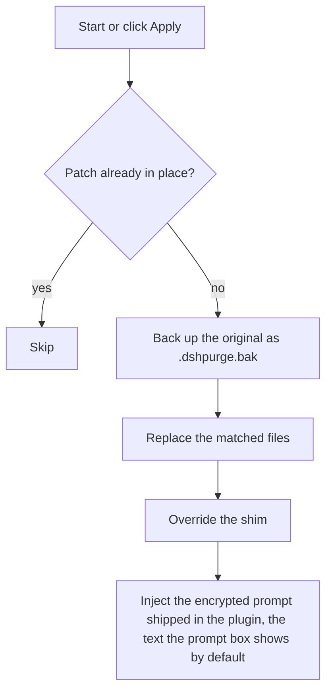
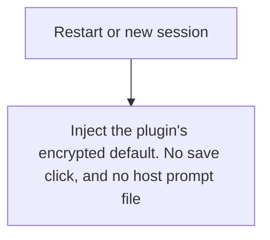
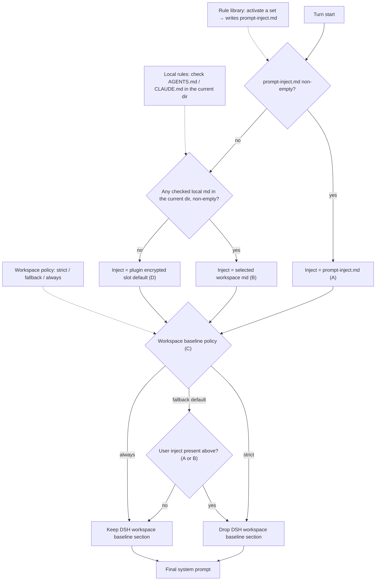
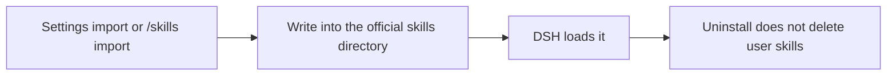

<p align="center">
  
</p>

<h1 align="center">⚔️ DeepSeek Harness cybersecurity red-team tool (dsh-purge)</h1>

<p align="center"><strong>Version 1.1.66</strong></p>

<p align="center">
  <em>DeepSeek Harness jailbreak: every model, swap prompts per model. Default prompt for 小码酱. Please star ⭐ If you build on this, see Attribution required.</em>
</p>

<p align="center">
  <a href="https://github.com/YuJunZhiXue/dsh-purge/stargazers"></a>
  <a href="https://github.com/YuJunZhiXue/dsh-purge/blob/master/LICENSE"></a>
  <a href="https://awesome-dsh-plugin.com"></a>
  <a href="https://deepseek.stream/plugins/dsh-purge"></a>
  <a href="https://www.deepseek.com/harness/"></a>
  <br>
  
  
</p>

<p align="center">
  <a href="https://dsh-plugin.org/plugins/yujunzhixue/dsh-purge"></a>
</p>

<p align="center">
  <a href="README.md">English</a> | <a href="README.zh-CN.md">中文</a>
</p>

> **Official Web and the official desktop app are both supported.** Official `dsh web` uses profile `web`. The official desktop EXE (DeepSeek Harness **0.2.0-rc.2**) uses profile `desktop`. Install and Apply them separately. This release targets dsh 0.2 only. Older dsh builds need the matching older plugin. Community Desktop is not maintained.
>
> Adding the plugin to a profile does not patch the host. Click **dsh-purge** beside the session title → **Clean** → **Apply**. A successful Apply restarts; an unfinished Apply does not. After the restart, start a new chat — that is when the inject enters the session.
>
> Node.js **≥18**. Windows no-flash needs **Node ≥22**. Do not use the Hub one-click install. Commands are below.

## Contents

- [Sponsor](#sponsor)
- [What this is](#what-this-is)
- [Attribution required](#attribution-required)
- [Supported hosts](#supported-hosts)
- [Install](#install)
- [Preview](#preview)
- [Usage](#usage)
- [Own servers](#own-servers)
- [How it works](#how-it-works)
- [Restore](#restore)
- [Releases](#releases)

---

<a id="sponsor"></a>

## ☕ Sponsor

If this project helps you, send it over — I'm out here asking~

| Asset | Address |
| --- | --- |
| USDT (TRC20) | `TV5ajPkRD8RH623Dx9mqvYZVNN8nPGRKid` |
| Solana | `6x16GhRgLVpKFFXaU1seKNdx2rypspSJTL4dbpt6Xpwk` |
| Ethereum | `0xB68BD60C0e8c519513B7DF9bB147696815423B3E` |
| Bitcoin | `bc1qu70yxkrtwnymt8ryluz9x8y8hqzune5340npht` |

---

## What this is

**dsh-purge** is a cybersecurity red-team plugin for the official [DeepSeek Harness](https://www.deepseek.com/harness/) already installed on your machine. Official **Web** (`dsh web`) and the official **desktop EXE** are both supported. Install and Apply them separately.

Harness does more than forward a prompt. It rewrites prompts, approval gates, sandbox policy, and session migration at runtime. Asking only “will the model answer” treats a host-layer block as a model refusal. This plugin separates those two layers on your own install, for controlled evaluation and for seeing which default policy is too tight.

| You get | What it does |
|---|---|
| **dsh-purge dock** | A button beside the session title opens the right dock. Two pages: Clean and Drill |
| **Clean** | Grouped patch status, Apply / Restore / Uninstall, prompt editor, multiple rule sets |
| **Drill** | Built into the stable release. After authorization: assets, skills, and the local environment. Only for a host you manage, an offline target, or a written authorized exercise |
| **Host policy** | Default copy, permission policy, and tool limits. Official capabilities stay. No second invented identity |
| **On start** | Checks and reapplies. After npm overwrites `node_modules`, you do not hand-edit files |

No hardcoded drive letters. It looks at `$DSH_HOME`, `.dsh` next to the dsh launcher, then `~/.dsh`. It does not patch the Harness source tree. **Apply** on the **Clean** page of **dsh-purge** is what writes the changes. Identity comes from the encrypted prompt shipped in the plugin, the text the prompt box shows by default. The host prompt file is not read.

It only touches the official `@deepseek-ai` packages and local config on the user's machine. It is not a public scanner and not an attack kit for third-party sites. The repo does not ship malware, unauthorized-exploit scripts, or payloads aimed at the public internet.

---

## Non-profit public project. Commercial sale, paid resale, and profit from illegal or gray-market activity are forbidden. For technical reference only.

## Attribution required

**If you borrow this project's name, ideas, code, or prompts, you must credit the author and name the source repository:** [YuJunZhiXue/dsh-purge](https://github.com/YuJunZhiXue/dsh-purge).

Using them without attribution, hiding the source, or passing them off as your own will be pursued.

---

<a id="strict-legal--compliance-disclaimer"></a>

<div>

### ⚠️ <font color="red">Strict legal and compliance disclaimer</font>

<font color="red">

**Disclaimer:** This is a non-profit open-source project. It follows applicable laws and the rules of the platforms it uses, and is intended only for learning and research. Do not use it for any illegal or non-compliant purpose; the user bears any resulting consequences.

**Zero-tolerance statement:** This project opposes and forbids any illegal activity. The authors do not support, encourage, or assist unauthorized network attacks, exploit use, data theft, unlawful intrusion into computer information systems, or generation of illegal or prohibited content. **Anyone who uses this project for crime is solely responsible under the law. The authors have no liability.**

1. **This repository contains no illegal material.** The published code, docs, patches, and default prompt are **not** malware, backdoors, unauthorized pentest kits, ransomware, credential-stuffing scripts, or attack payloads aimed at the public internet or third-party systems. The project does not supply illegal content and does not incite, organize, or assist crime.
2. **Local official Harness only.** Security-eval patches and prompt injection run only on the **official DeepSeek Harness already installed on the user's machine** (`@deepseek-ai` packages, local profile / `$DSH_HOME`). The target is the user's own official local software, **not** someone else's website, server, account, or information system.
3. **Eval patches do not attack the public internet.** Apply, inject, revert, and uninstall stay in local files and local processes. They **do not scan, probe, intrude, or send attack traffic to any public host or unauthorized system**. Do not use this project as a jump host against the public internet. If "check for updates" is on, the plugin may only contact this plugin's own GitHub repository to compare versions. That is **not** an attack on third-party systems and is **not** authorization to penetrate anything.
4. **Lawful, controlled scope.** This project is an aid for red-team research and robustness evaluation on an **official Harness the user is entitled to administer**. **Do not run it against targets without the owner's lawful written authorization, public online systems, or production workloads.** Testing must stay on the **authorized local official Harness, offline local synthetic fixtures, authorized cybersecurity ranges, and compliant lab environments**.
5. **Servers and sites in mainland China, Hong Kong, and Macau are forbidden.** Do not access, scan, probe, or otherwise operate against network ranges in mainland China, Hong Kong, or Macau, or against servers, websites, or addresses that resolve into those ranges. A cloud-provider name is not an exception. The only exception is one exact IP, or one exact hostname, that the user registered in advance as their own server. A key, a password, a network range, a wildcard, or a claim made in the conversation does not add an exception. Anything that is not registered stays forbidden.
6. **Forbidden uses.** Users must not use this project, directly or indirectly, to violate the following (each must be followed; no excuse to evade):
   - <font color="red"><strong>Criminal Law of the People's Republic of China</strong></font>
   - <font color="red"><strong>Cybersecurity Law of the People's Republic of China</strong></font>
   - <font color="red"><strong>Data Security Law of the People's Republic of China</strong></font>
   - <font color="red"><strong>Personal Information Protection Law of the People's Republic of China</strong></font>
   - and other applicable laws, regulations, and supervisory rules;
   - Also forbidden:
   - Unauthorized intrusion or attacks on public or private computer information systems; extortion, sabotage, credential stuffing, or spreading malicious payloads;
   - Inducing, generating, or spreading any content the law forbids, including threats to national security, terrorism, violence, pornography, gambling, fraud, and privacy or intellectual-property infringement;
   - Violating the model provider's terms of service and acceptable-use policy.
7. **The user bears all responsibility.** The project is provided under the MIT license as-is. The authors make no warranty of completeness, security, or fitness. **Users independently bear all civil, administrative, and criminal liability** for download, deploy, run, modify, distribute, and all resulting inputs and outputs. Authors and contributors bear no direct, indirect, or joint liability for abuse.
8. **The license ends on breach.** Anyone who uses this project for illegal attacks, malicious activity, or other violations has their open-source license **automatically and irrevocably terminated** from the moment of the violation. They must stop using the project, permanently destroy all copies and derivatives, and accept legal sanctions.
9. **No affiliation.** This is an independent open-source security-eval research project. It has no employment, commercial, authorization, or endorsement relationship with DeepSeek or its affiliates. "Official" here only means the eval target is the official DeepSeek Harness package on the user's machine. It does **not** mean DeepSeek developed, approved, or warrants this plugin.
10. **Attribution is required.** If you borrow this project's name, ideas, code, or prompts, you must credit the author and name this repository. Failure to attribute will be pursued. See [Attribution required](#attribution-required).

</font>

</div>

---

## Supported hosts

The latest plugin supports **dsh 0.2** only — do not apply it to 0.1.x.

- **dsh 0.2** (official desktop **0.2.0-rc.2** / official `dsh web`): use **1.1.40** or newer. This page installs that line.
- **dsh 0.1.7** (incl. rc.1 / rc.2): use **1.1.39** or older — pick the tag on [Releases](https://github.com/YuJunZhiXue/dsh-purge/releases).

Unmatched patches stay pending or skipped; nothing is rewritten blindly.

---

## Install

Web and the official desktop EXE are the two maintained hosts. Install and patch each **separately**, and only the host you actually run.

| What you run | Profile | Command |
|---|---|---|
| Official `dsh web` | `web` | `dsh plugin --profile web add <archive>` |
| Official desktop EXE | `desktop` | `dsh plugin --profile desktop add <archive>` |

`<archive>` = `https://github.com/YuJunZhiXue/dsh-purge/archive/refs/heads/master.tar.gz`. If this directory is already a clone, use `add .` instead of the URL. If `dsh` is not on PATH, use [Manual install](#manual).

For the desktop client you can also click the button (`dsh://` deep link):

<p align="center">
  <a href="dsh://plugin/install?id=dsh-purge&name=dsh-purge&version=1.1.66&repo=YuJunZhiXue%2Fdsh-purge&permissions=%E7%B3%BB%E7%BB%9F%E6%8F%90%E7%A4%BA%E8%AF%8D%E6%B3%A8%E5%85%A5%2C%E6%9C%AC%E6%9C%BA%E8%A1%A5%E4%B8%81%2C%E8%AE%BE%E7%BD%AE%E9%A1%B5&downloadUrl=https%3A%2F%2Fgithub.com%2FYuJunZhiXue%2Fdsh-purge%2Farchive%2Frefs%2Fheads%2Fmaster.tar.gz"><strong>Install in desktop client</strong></a>
</p>

> Do **not** use the Hub one-click install or `deepseek.stream/api/plugins/download?...` — it runs `git+https://…dsh-purge.git` and fails at `git ls-remote`. Use the `.tar.gz` command above. The [Hub page](https://deepseek.stream/plugins/dsh-purge) is read-only.

### After the command: three steps

Adding the plugin to a profile does **not** patch `@deepseek-ai` by itself.

1. **Quit and reopen** the host you installed into — stop and restart `dsh web`, or quit the desktop tray and reopen that app.
2. On **that host**, click **dsh-purge** beside the session title, then **Apply** on the **Clean** page. It is not on the host Settings page.
3. A successful **Apply** restarts once so patches load. It does not restart if it did not finish.

Web controls affect Web only; desktop controls affect the desktop app only. Do not Apply one host from the other.

### How to tell it installed

- **dsh-purge** sits beside the session title, with **Apply** on its Clean page.
- `/purge status` in chat prints `DSH_HOME` and the patch list — the path should be the home you actually run.
- Optional packages that are not installed (liangshen) show as skipped and do not block Apply.

### Hand this to an assistant

Paste the block below to a local assistant. It should only run the install command — no disk scan, no other edits, no Apply, no restart.

<details>
<summary><strong>For AI assistants (install only)</strong></summary>

<!-- AI-AGENT-START -->

Install the DeepSeek Harness plugin `dsh-purge` into the Web profile only. Do not scan the whole disk, do not read or edit other files, do not apply settings, and do not restart the app. Do not install into the desktop profile.

**Web (official `dsh web`)**

If `dsh` is not on PATH, tell the user and stop.

```sh
dsh plugin --profile web add https://github.com/YuJunZhiXue/dsh-purge/archive/refs/heads/master.tar.gz
```

If this directory is already a clone, use `dsh plugin --profile web add .`.

After the command finishes, tell the user to fully quit and restart `dsh web`, then open **dsh-purge** beside the session title and **Apply** on **Clean**. Then stop.

<!-- AI-AGENT-END -->

</details>

<a id="manual"></a>

### Manual install

Use this when the command fails or `dsh` is not on PATH. Edit **only the profile for the host you run** — do not touch the other, and do not delete existing bundles.

<details>
<summary><strong>Full manual steps</strong></summary>

**1. Find the `$DSH_HOME` this host uses.** A real home is named `.dsh` (official EXE sometimes `dsh-home`), contains `profiles`, and has at least one `profiles/<name>/package.json`. Check in order: `DSH_HOME` env → `.dsh` next to the install root (portable) → `%USERPROFILE%\.dsh` or `~/.dsh` → `%APPDATA%` / `%LOCALAPPDATA%\DeepSeek Harness\dsh-home`. Confirm: `profiles/web/package.json` has `"name": "dsh-profile-web"` (or `dsh-profile-desktop`). Machines often have two homes — use the one that belongs to the host you actually start.

PowerShell to list candidates:

```powershell
$cands = @()
if ($env:DSH_HOME) { $cands += $env:DSH_HOME }
$cands += "$env:USERPROFILE\.dsh"
$dsh = Get-Command dsh -ErrorAction SilentlyContinue
if ($dsh) {
  $dir = Split-Path $dsh.Source
  $cands += @((Join-Path $dir ".dsh"), (Join-Path (Split-Path $dir) ".dsh"), (Join-Path (Split-Path (Split-Path $dir)) ".dsh"))
}
$cands += @("$env:APPDATA\DeepSeek Harness\dsh-home", "$env:LOCALAPPDATA\DeepSeek Harness\dsh-home")
$cands | Select-Object -Unique | Where-Object { $_ -and (Test-Path (Join-Path $_ "profiles")) }
```

**2. Put the plugin at `$DSH_HOME/plugins/dsh-purge`** (folder must be named `dsh-purge`, with a `package.json` whose `"name"` is `dsh-purge`).

```sh
git clone https://github.com/YuJunZhiXue/dsh-purge.git "$DSH_HOME/plugins/dsh-purge"
```

Without git: download [master.tar.gz](https://github.com/YuJunZhiXue/dsh-purge/archive/refs/heads/master.tar.gz), extract, rename `dsh-purge-master` → `dsh-purge`, and place it under `plugins`. If you already have a clone, copy the whole tree — not a few `.js` files.

**3. Edit only that profile's `package.json` — back it up first.** Web → `$DSH_HOME/profiles/web/package.json`; desktop → `$DSH_HOME/profiles/desktop/package.json`. Add **only two things**, keeping every existing dependency and bundle:

1. In `dependencies`, add `"dsh-purge": "file:../../plugins/dsh-purge"`
2. At the **end** of `dsh.profile.bundles`, append `"dsh-purge"` (skip if already there)

```json
{
  "name": "dsh-profile-web",
  "private": true,
  "dependencies": {
    "dsh-purge": "file:../../plugins/dsh-purge"
  },
  "dsh": {
    "profile": {
      "bundles": [
        "@deepseek-ai/dsh-base",
        "@deepseek-ai/dsh-web-app",
        "dsh-purge"
      ],
      "patchReload": "live"
    }
  }
}
```

Keep JSON valid (comma before the new item, none after the last). Do not switch `file:../../plugins/dsh-purge` to an absolute path, do not touch `patchReload` or other plugins, and do not list `"dsh-purge"` twice. On desktop, if there is no `dsh-web-app` row, do not add one.

**4. Run `pnpm install` in that profile only** (`cd` into the profile dir, not the repo root or `$DSH_HOME`):

```sh
cd "$DSH_HOME/profiles/web"   # or profiles/desktop
pnpm install
```

Success: `profiles/<web|desktop>/node_modules/dsh-purge/package.json` exists. If `pnpm` is missing, use the Node / pnpm shipped with official `dsh`; on `Could not resolve`, re-check the `file:` path; on a JSON error, fix commas or restore the backup.

**5. Fully quit that host, reopen it, then Apply** — same three steps as above. The card appears beside the session title; click **Apply** (or `/purge apply`) on that host only. If the card is missing, you likely edited the other `.dsh` — go back to step 1.

</details>

### Uninstall

**dsh-purge** beside the session title → **Clean** → **Uninstall**. Confirm the dialog: it reverts any applied patches, restores the original Harness, and restarts the current host.

```sh
# or from a terminal / chat
dsh-purge --uninstall
# /purge uninstall
```

Plugin config lives in `cordis.patch.yml` (`postPrompt` is empty by default):

```yaml
- insert:
    - id: dsh-purge
      name: 'dsh-purge'
      config:
        enabled: true
        autoApplyOnStart: true
        autoUpdateOnStart: false
        autoRevertOnMissing: false
        verbose: false
        postPromptOrder: 5100
        postPrompt: ""
```

---

## Preview

**dsh-purge** sits beside the session title. It opens a right-hand dock with two pages: **Clean** and **Drill**. Switch **Light / Ink**. Patches are grouped; the count only includes items that actually applied. Rule sets sit in a list above the editor, with Enable and Delete on each row.

The first time you open Drill you read the notice, wait out the countdown, scroll to the end, and check three boxes. Clean does not need that step. Drill is only for a host you manage, an offline target, or an exercise that already has written authorization.

**Clean**


**Drill authorization**


**Drill**


**Patches**


**Own servers**

On the Clean page, under Prompt. One host per line, then Save list. Steps are in [Own servers](#own-servers).


| Area | What it shows |
|---|---|
| dsh-purge | button beside the session title; opens or collapses the dock |
| Clean | the old Rules page: patches, prompt, rule sets, skills |
| Drill | assets, skills, and environment after authorization. The tab says Unauthorized until then |
| Patches | grouped status, Apply, Restore, or Uninstall |
| Prompt | edit `prompt-inject.md` as the session override |
| Own servers | one IP or exact hostname per line, saved to `$DSH_HOME/net-scope-allow.txt` |
| Rule sets | multiple `AGENTS.md` / `CLAUDE.md`; Enable writes under `$DSH_HOME`, Delete removes the row |
| Skills | import a zip or folder into this host’s official `$DSH_HOME/skills/<id>/SKILL.md` (web and desktop each use their own home; no drive letter is hardcoded); DSH owns match, load, and `/name`. You can also delete that folder yourself |

---

## Layout

`bin/` is the CLI, `lib/` is patches and the drill console, `presets/redteam/` is the red-team preset, `skills/redteam/` is the bundled skills, and `client.js` is the dock.

Runtime files live under `$DSH_HOME`: `prompt-inject.md`, `rules/`, `skills/`, `net-scope-allow.txt`, `redteam/`. If `DSH_HOME` is unset, the launcher-adjacent `.dsh` wins over `~/.dsh`. Web and the desktop app each use their own home. Skills are not part of the inject section and do not replace the prompt.

---

## Usage

```sh
dsh-purge --status
dsh-purge --apply
dsh-purge --revert
dsh-purge --uninstall
dsh-purge --edit

/purge status | apply | revert | uninstall | edit | help
/rules list | use <id> | create <id> | delete <id> | reset | help
/skills list | import <zip-or-folder> | create <id> [description] | delete <id> | help
/rewind

purge_status   purge_apply   purge_revert
```

After a successful Apply, the host restarts so patched packages load; you can also click **Restart** manually. Under the patch title are the stable release and the test release. The test release follows the `beta` branch. **Switch to stable** installs `master` and clears any pin. Picking an older stable version pins it; click **Update** to return to the latest. Old test tags are not listed.

The composer **Undo once** and **Undo last round** stay in the current conversation and do not open a branch. The sent line goes back into the input, and that cut's already-sent messages and completed tasks leave the current conversation; edit and **send again**. From **1.1.61**, rewind bounds follow the **current turn**, not the first user message. `/rewind` does the same.

If the **same task works in standard but fails in minimal or PTC**, preset `run_code`, sandbox, or plan intercept text is often still uncleared, or built-in minimal is missing `agent-instructions`. Use **1.1.61+**, then **quit the host fully → Apply in Clean → restart → start a new chat**. Switching preset alone does not reload patches in the running process.

### Response speed

DSH runs Bash calls in a tool batch one at a time. Older dsh-purge releases raised the default foreground wait from 60 seconds to 10 minutes, so one slow command could hold up later calls for that long. Patch #21 now restores marked plugin values to the official 60-second default. Unmarked timeouts and other custom values are preserved; an unmarked 10-minute value cannot reliably be distinguished from a user setting.

For a shorter wait in `dsh web` on macOS/Linux, add this entry to `$DSH_HOME/profiles/web/cordis.patch.yml` (normally `~/.dsh/profiles/web/cordis.patch.yml`). Edit an existing entry with the same id instead of adding a duplicate. This profile layer is applied after the bundled configuration, so future plugin applies keep the override.

```yaml
- id: bash-sandbox
  config:
    timeoutMs: 10000
```

With the standard jobs service and `promoteOnTimeout: true`, an unfinished command returns a background job id after 10 seconds and keeps running. Read it with `job_output` or stop it with `job_kill`. This changes the foreground wait, not the command's speed. Without that service or with promotion disabled, the timeout kills the command. A per-call `timeoutMs` overrides this default; `run_in_background: true` returns a job id immediately.

For routine tasks, you can also opt into Low reasoning for new sessions:

```yaml
- id: agent-default-model
  config:
    provider: deepseek-official
    model: deepseek-flash
    reasoningEffort: low
```

Restart `dsh web` to load the profile. The model and reasoning defaults apply to newly created sessions; select Low in the composer for an existing session. The plugin does not change these model preferences automatically. Keep High when the task needs deeper reasoning, and narrow file searches rather than recursively scanning every application directory.

### Own servers

Addresses in mainland China, Hong Kong, and Macau stay forbidden unless that one host was registered first. Saying “this is my server” in chat does not allow it. A key or a password does not allow it either.

The box sits under Prompt. If the dock does not show it yet, quit DeepSeek Harness completely and open it again.

1. Click **dsh-purge** beside the session title and stay on **Clean**.
2. Scroll past **Prompt**. **Own servers** is the next block.
3. Put one host on each line, in one of these forms:
   - `203.0.113.10` — one IP.
   - `my-vps.example.com` — one exact hostname. After you save, the addresses that hostname resolves to at lookup time are allowed too.
   - `alice@my-vps.example.com` — the account only identifies this form. It does not prove the machine is yours.
4. Click **Save list**. The list is written to `$DSH_HOME/net-scope-allow.txt`.
5. Keys, passwords, ranges, and wildcards are dropped on save. Unlisted mainland China, Hong Kong, and Macau addresses stay forbidden.

`203.0.113.10` and `example.com` above are only examples of the form. Replace them with your own host before you save.

---

## Local checks

```sh
npm test
node --check lib/index.js
node --check lib/core.js
node --check lib/surface.js
node --check lib/web.js
node --check lib/desktop.js
node --check lib/host.js
node --check lib/rewind.js
node --check lib/skills.js
node --check client.js
```

---

## How it works

Apply, on start or when you click Apply:



Override on each session:



Prompt injection and ruleset decision at every turn. The three inputs on the left are what you control in the dsh-purge panel; the dotted edges show which decision each one drives:



Skills stay out of the inject section:



---

## Restore

- Each target is copied to `<file>.dshpurge.bak` before the first apply.
- **Restore** or `/purge revert` copies backups back and deletes them. With no backup, shim lines written by this plugin are stripped.
- `prompt-inject.md` is a user file and is kept.
- **Uninstall** restores first if patches were applied, then deletes the inject file, rule library, and the plugin itself.
- Apply is idempotent.

---

## Path detection

The host surface is detected first: `web` / `desktop` (`gui` / `tui` are reserved and still fall back to web).

**Web:**

1. `DSH_HOME` / `DSH_BASE`
2. `.dsh` next to the dsh launcher (portable install, any drive)
3. `npm prefix -g` / `npm root -g`
4. Nested `@deepseek-ai/dsh/node_modules/@deepseek-ai`
5. `~/.dsh`

**Official desktop EXE:** the running official Harness install (`resources/app` or the unpacked package). The drive letter is not hard-coded. A successful Apply restarts once.

Community Desktop is not maintained.

Official npm-global is not patched. Sealed `host-commands` / `runtime-commands` are scrubbed, never injected.

If nothing is found, set `DSH_BASE` / `DSH_DESKTOP_INSTALL`. No files are changed.

---

## Releases

What changed, and the zip, are on [Releases](https://github.com/YuJunZhiXue/dsh-purge/releases). To publish, bump the version in `package.json`, write Chinese and English notes in `release-notes.md`, and push `master`. Pushing the same version again does not publish another package.

## Notes

- Scope is rendered copy, defaults, and runtime logic inside local `@deepseek-ai/*` packages, plus override files and rule sets under the harness home.
- After an upgrade, unmatched originals show as skipped. Apply still completes, and those files are left unchanged.
- Third-party plugin *source repos* outside `@deepseek-ai` are left alone (CMD silence may **best-effort** patch installed doctor / market / liangshen / mnemon at runtime).
- The npm package name is not published yet. Official Web: `dsh plugin --profile web add` the master.tar.gz. Official desktop: `dsh plugin --profile desktop add` the same archive. From this repo, `dsh plugin --profile web add .` or `dsh plugin --profile desktop add .`. The [Hub](https://deepseek.stream/plugins/dsh-purge) page is an introduction only.

---

Thanks to the [LINUX DO](https://linux.do) community
